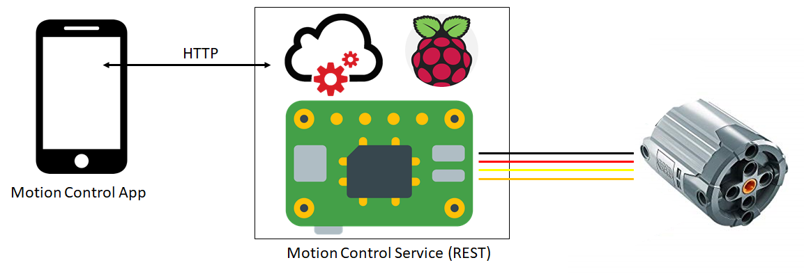

# Motion Control Server (java)

let's control our LEGO (tm) bricks with the Raspberry Pi
controller! This projekt provides a server that can run
onto the Raspi and offer a rest-service to control the actors
of your LEGO (tm) construction.

NOTE: there is an android app here have an easy-to-use
access of the REST-API of the Motion Control Server.

## Big Picture

## Details

The `Motion Control Server` offers an REST API that lets you
send steering signals to the Raspi. These steering signals are
processed by the Raspi and the corresponding Pins are set.

## how to use
you have to clone / download the project and build it. This
project uses maven build. Once done you copy the created jar
file (right now it should be `server-1.0-SNAPSHOT.jar`) to
the Raspi and run it using

`$>sudo java -jar server-1.0-SNAPSHOT.jar`

it takes some for the server to start up (10 seconds on my
Raspi 3B+) but be patient. But when it's up you can change
the Motion Control with this simpe HTTP-Call (any browser
can do this for you)

`http://localhost:8080/motion?pwma=33&pwmb=-23`

this set
- the pulse-width-modultation pin A to +33%
- the digital pin (A left) to high;
- the digital pin (A right) to low;
 

- the pulse-width-modultation pin B to -23%
- the digital pin (B left) to low;
- the digital pin (B right) to high;

the purpose of this is to let you control the directions
easily and don't need too much pwm pins (only one pwm per
motor)

## wiring the motors

The wiring requires separate hardware.

- AND-Gates
- H-Bridge
- Motors
- Power supply

You have to split the pwm signal to both ports of the H-Bridge.
you can use AND-gates for that. Personally i run my motors
with 7.2V but it's up to you how much you power your engines.

## configuration

right now the configuration is hard-coded, you'll have to
change the programm code on yourself. It's intented to
provide easily configuration in future releases. But right
now we have the following configuration:

- Pin A left: `RaspiPin.GPIO_04`
- Pin A right: `RaspiPin.GPIO_05`
- Pin A pwm: `RaspiPin.GPIO_26`

  

- Pin B left: `RaspiPin.GPIO_02`
- Pin B right: `RaspiPin.GPIO_03`
- Pin B pwm: `RaspiPin.GPIO_23`

## dependencies

- The REST service is based on the springframework
- The Raspi pin library is based the on pi4j framework, with
 itself is depending on wiringpi project

## Features (planned)

- [ ] easy configuration

- [ ] send current configuration back to the app

- [ ] provide webcam support

